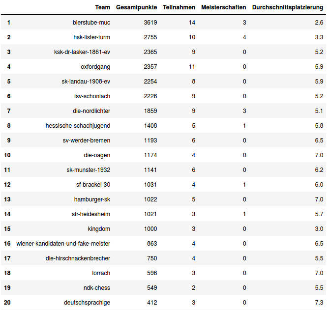
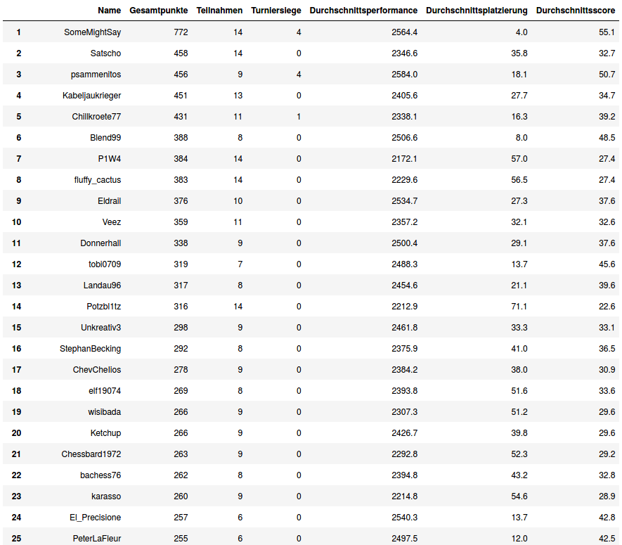

# All-Time Standings in Lichess Quarantaine Bundesliga

This repo contains a python notebook that will generate the all-time standings in the Lichess Quarantaine Bundesliga.  

## Output:
### All-Time Team Standings of Lichess Quarantaine Bundesliga

### All-Time Individual Standings of Lichess Quarantaine Bundesliga

## Prerequisites:
### Recommended Python Installation:
Out of the box anaconda with python 3.7, available from https://www.anaconda.com/distribution/
### Necessary Python Installation:
- Python 3.7
- beautifulSoup
- pandas

## How to run:
Just execute all cells of the notebook in order.

## What's next
At the moment all the code is in a notebook. Also the output is can only be views (or sceenshoted) in the jupyter notebook. If we push this further we should wrap it into a .py file and think about an output format. It would be nice to have it autmatically updated after every tournament and embedded into some website. 

